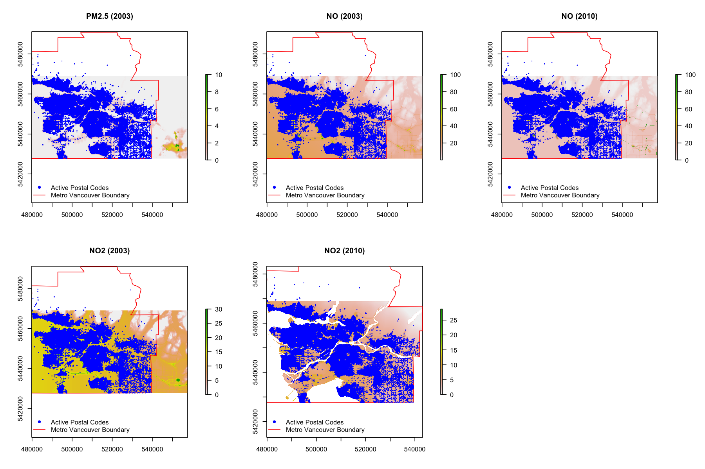

# Introduction

This code was used to develop temporally adjusted average measures of air pollution in Metro Vancouver from 2003–2009 by combining land use regression (LUR) models developed by Henderson et al.[1](https://pubs.acs.org/doi/abs/10.1021/es0606780) with continuous air monitoring data from Metro Vancouver’s Air Quality Monitoring Network. Temporally adjusting the LUR models enabled us to incorporate annual and seasonal trends to estimate monthly mean exposures of ambient air pollution at all 6-digit postal codes within Metro Vancouver. We used predictive mean matching to impute missing air monitoring station data.

We developed temporal factors as a ratio between the monthly mean of air pollutant concentrations across all air monitors for the month of interest over the annual mean of air pollutant concentrations across all air monitors for the LUR year.[2](https://ehp.niehs.nih.gov/1408700/) Then, we derived minimum concentrations by calculating the mean from the lowest daily average in a month for all air monitors for each month of the LUR year. To avoid potentially estimating values of zero, LUR models were truncated before temporal adjustment. We extracted air pollutant concentrations from the truncated LUR models at all postal codes within the study area, and then multiplied them by the temporal factors to produce monthly air pollutant estimates for all postal codes.

## Data Descriptions

### Files
- Results/temporally_adjusted_air_pollution_models.csv
- Figures/lur_postalcode_map.png

### Record Layout

| Variable | Description |
|:--|:--|
| DATE | Date formatted as YYYY-MM-DD |
| POSTAL.CODE | 6-digit postal code |
| PM25 | Estimated concentrations of PM2.5 in micrograms per cubic meter (ug/m3) |
| NO | Estimated concentrations of NO in parts per billion (ppb) |
| NO2 | Estimated concentrations of NO2 in parts per billion (ppb) |

### Maps

LUR and all active postal codes in Metro Vancouver from 2003–2009.

## Data Sources

### Land Use Regression Models

- Henderson SB, Beckerman B, Jerrett M, Brauer M.  [Application of land use regression to estimate ambient concentrations of traffic-related NOx and fine particulate matter](https://pubs.acs.org/doi/abs/10.1021/es0606780).  Environmental Science and Technology. 2007; 41 (7):2422-2428.
- Wang R, Henderson SB, Sbihi H, Allen RW, Brauer M. [Temporal Stability of Land Use Regression Models for Traffic-Related Air Pollution](https://www.sciencedirect.com/science/article/pii/S1352231012009272?via%3Dihub). Atmospheric Environment, 2012. 64: 312-319.

### Metro Vancouver Air Quality Monitoring Network
- [Air Quality & Climate Change, Metro Vancouver](http://www.metrovancouver.org/air)

### Postal Code Conversion Files
- **2003**: 2009-11-19, "Census of Canada. Postal Code Conversion File, January 2003 Postal Codes, 2001", [http://hdl.handle.net.proxy.lib.sfu.ca/11272/TF2D9](http://hdl.handle.net.proxy.lib.sfu.ca/11272/TF2D9) V3 [Version]
- **2004**: 2009-11-19, "Census of Canada. Postal Code Conversion File, July 2004 Postal Codes, 2001", [http://hdl.handle.net.proxy.lib.sfu.ca/11272/SRHXK](http://hdl.handle.net.proxy.lib.sfu.ca/11272/SRHXK) V2 [Version]
- **2005**: 2009-11-18, "Census of Canada. Postal Code Conversion File, October 2005 Postal Codes, 2001", [http://hdl.handle.net.proxy.lib.sfu.ca/11272/92QKP](http://hdl.handle.net.proxy.lib.sfu.ca/11272/92QKP) V3 [Version]
- **2006**: 2009-11-19, "Census of Canada. Postal Code Conversion File, September 2006 Postal Codes, 2001", [http://hdl.handle.net.proxy.lib.sfu.ca/11272/HQIOQ](http://hdl.handle.net.proxy.lib.sfu.ca/11272/HQIOQ) V2 [Version]
- **2007**: 2009-11-19, "Census of Canada. Postal Code Conversion File, September 2007 Postal Codes, 2006 [2007]", [http://hdl.handle.net.proxy.lib.sfu.ca/11272/PVVYH](http://hdl.handle.net.proxy.lib.sfu.ca/11272/PVVYH) V2 [Version]
- **2008**: 2009-11-18, "Census of Canada. Postal Code Conversion File, March 2008 Postal Codes, 2006 [2008]", [http://hdl.handle.net.proxy.lib.sfu.ca/11272/LNEEC](http://hdl.handle.net.proxy.lib.sfu.ca/11272/LNEEC) V3 [Version]
- **2009**: 2010-01-28, "Census of Canada. Postal Code Conversion File, July 2009 Postal Codes, 2006 [2009]", [http://hdl.handle.net.proxy.lib.sfu.ca/11272/NTC6K](http://hdl.handle.net.proxy.lib.sfu.ca/11272/NTC6K) V3 [Version]
- **2010**: 2011-02-07, "Census of Canada. Postal Code Conversion File, October 2010 Postal Codes, 2006 [2011]", [http://hdl.handle.net.proxy.lib.sfu.ca/11272/KO7Q0](http://hdl.handle.net.proxy.lib.sfu.ca/11272/KO7Q0) V3 [Version]
- **2011**: 2011-07-20, "Census of Canada. Postal Code Conversion File, May 2011 Postal Codes, 2006 [2011]", [http://hdl.handle.net.proxy.lib.sfu.ca/11272/DCQV4](http://hdl.handle.net.proxy.lib.sfu.ca/11272/DCQV4) V3 [Version]
- **2012**: 2013-09-11, "Platinum Postal Suite, v2012.3, [2012]", [http://hdl.handle.net.proxy.lib.sfu.ca/11272/XUMWO](http://hdl.handle.net.proxy.lib.sfu.ca/11272/XUMWO) V2 [Version]
- **2013**: 2013, "Census of Canada. Postal Code Conversion File, June 2013 Postal Codes, 2011 [2013]", [http://hdl.handle.net.proxy.lib.sfu.ca/11272/10029](http://hdl.handle.net.proxy.lib.sfu.ca/11272/10029) Statistics Canada [Distributor] V4 [Version]
- **2014**: 2014-04, "Postal Code Conversion File, November 2014 Postal Codes, 2015", [http://hdl.handle.net.proxy.lib.sfu.ca/11272/10193](http://hdl.handle.net.proxy.lib.sfu.ca/11272/10193) Statistics Canada [Distributor] V3 [Version]

### GIS Boundary Files
- 2011 Census Boundary Files, [Statistics Canada](http://www12.statcan.gc.ca/census-recensement/2011/geo/bound-limit/bound-limit-2011-eng.cfm)
- Municipal Boundaries, [Metro Vancouver Open Data Catalogue](http://www.metrovancouver.org/data)

## Disclaimer

The information provided in these data is intended for educational and informational purposes only. These data are not intended to endorse or recommend any particular product, material or service provider nor is it intended as a substitute for engineering, legal or other professional advice. Such advice should be sought from qualified professionals.
